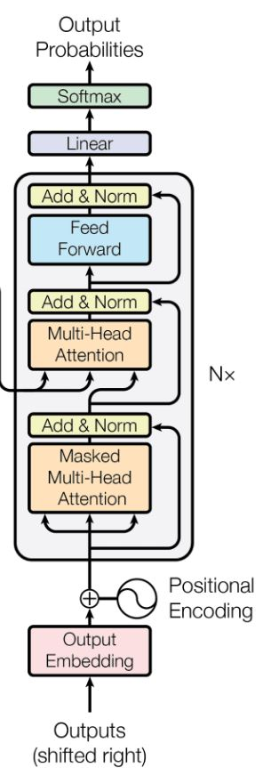

# GPT2 🤖

Reproduction of GPT2 124M with PyTorch on Fine Web edu dataset by 🤗.  



# Device 💻🔋🔧
The model is trained on a single A100 GPU with 40GB memory. Note that if the model does not fit in your GPU memory, you can reduce the batch size or sequence length. Also note that for the purpose of effitient training, try to use "NICE POWERS OF 2" numbers, becuase at core of the GPU design everything is in Tensor Cores manner, which are optimized for 2^n operations.

# Reference Code 💻🔖
The official [GPT2](https://github.com/openai/gpt-2) code release from OpenAI, supposed to be our reference, however the code is in TensorFlow and the dataset is not available. Therefore, instead of using the official code, we use the 🤗 [implementation](https://github.com/huggingface/transformers/tree/main/src/transformers/models/gpt2) of it as our reference to reproduce the GPT2 model to have confidence that we are implementing correctly!

# Reference Papers and Dataset 🔖
- [GPT2](https://arxiv.org/abs/2005.14165)
- [FineWeb edu🍷 dataset](https://huggingface.co/datasets/HuggingFaceFW/fineweb)

# Requirements
run `pip install -r requirements.txt` to install the required packages.

# Usage  📊
```bash
python src/gpt2.py
```

# Sample Output for max_length=30 in only step=2000 📤 
```txt
> Hello, I'm a language model, and I'm a very good teacher. If you didn't know how to solve math you can't teach you a better

> Hello, I'm a language model, and I believe what I'm talking about is very important, yet in my own family.
The problem with our online

> Hello, I'm a languag
e model, and I've been living a hard while for many years at the same site (my first experience in the past). I

> Hello, I'm a language model, and I think she's got a lot more complicated. Of course, I just wanted a system with everything she knows.
```
